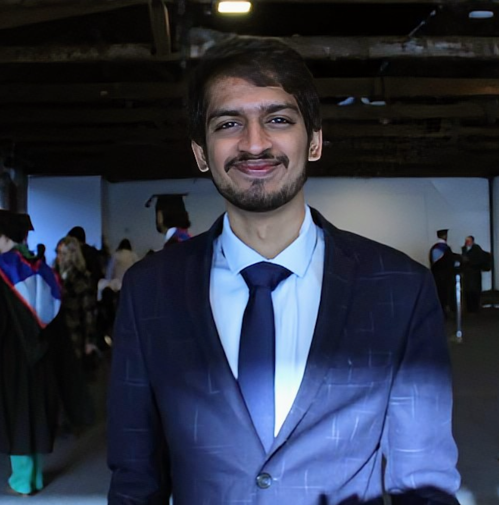

Hi, I’m Subramaniam (or Subro).
I’m a software engineer and incoming PhD student at Queen Mary University of London, funded by the EPSRC DTP. My research focuses on detecting and identifying RF signals using Software-Defined Radio (SDR), advanced antennas, and AI/ML technologies.

I work with Python (Django, Flask), SQL, and machine learning tools like TensorFlow and PyTorch. I also build cloud solutions using AWS services like Lambda, EC2, RDS, and more.

I’m passionate about making AI accessible and love sharing what I learn through blogs and conversations.

Let’s connect: subramaniamsmurugesan@gmail.com

Follow me and let's connect:

<a href="https://www.linkedin.com/in/subramaniam-s-m/" target="_blank" title="LinkedIn">
    <i class="fab fa-linkedin"></i> LinkedIn
</a> | 
<a href="https://github.com/Subramaniam-dot" target="_blank" title="GitHub">
    <i class="fab fa-github"></i> GitHub
</a> | 
<a href="https://twitter.com/rocketguy223" target="_blank" title="Twitter">
    <i class="fab fa-twitter"></i> Twitter
</a>
